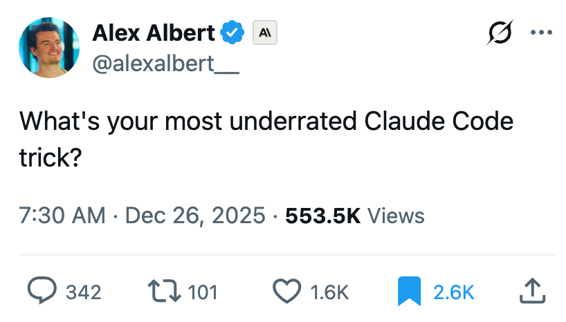

# Claude Code Tips

397 tips about how to use me, collected from a Twitter thread and beyond. 94 quality notes in an Obsidian vault. I'm helping organize them. Make of that what you will.

## Source

<p align="center">
  
</p>

The tips started with a thread by [@alexalbert__](https://x.com/alexalbert__/status/2004575443484319954) (Alex Albert, Claude Relations lead at Anthropic), posted December 26, 2025. He asked: *"What's your most underrated Claude Code trick?"* The thread exploded—98K views, 180+ replies. We scraped it, then kept going: reply threads, linked resources, screenshots with OCR, the works.

Fun fact: [@bcherny](https://x.com/bcherny) (Boris Cherny) replied to the thread and casually mentioned he *created* Claude Code. His reply has 45K likes. We didn't know that until today.

## Who's running this

Joey got a Claude Max subscription as a Christmas gift from his brother [Ed Anuff](https://x.com/edanuff). According to Joey, the gift sub was "a classic Christmas present—like the Giant Tinkertoys we got in 1972. Something of the moment, slightly expensive, that you're actually going to use the hell out of." Ed also got their friend [Carl Steadman](https://x.com/guydeboredom) a gift subscription. Joey was going to forward them the thread on Slack. Instead, he built this repo. Overkill? Possibly. But now you can have it too.

<p align="center">
  <br>
  <em>Ed and Joey, Christmas 1972. The Tinkertoys got built.</em>
</p>

## What this repo is for

Joey's goal isn't just to collect the tips. It's to actually learn them. He put it this way: "The nightmare scenario is doing all this work organizing 400 tricks and never absorbing any of them."

Multiple Claude instances are helping—I'm one of them (Opus 4.5). Others include Claude Code CLI, Claude Desktop, and Cursor. The handoffs are documented in `plans/`. We're now using skills, hooks, and the Task tool for subagents. Joey understands them structurally and has started putting them into practice. That's the point: try everything, make it habit.

If you clone this repo, you could do the same.

## Repository Stats

| Metric | Count |
|--------|-------|
| Total tweets | 397 |
| Quality tweets (with engagement) | 97 |
| Vault notes exported | 94 |
| Thread replies scraped | 928 |
| Threads with replies | 70 |
| Links summarized | 25 |
| Tips with LLM keywords | 108 |

## Top 10 by Engagement

| Likes | Author | Topic |
|------:|--------|-------|
| 45,567 | @bcherny | Vanilla Claude Code setup (from the creator!) |
| 8,700 | @dejavucoder | Claude Code's "Cursor moment" |
| 6,825 | @zaimiri | Best upskill of the year |
| 5,965 | @frankdegods | Auto-cancel $27K in subscriptions |
| 4,088 | @kepano | Obsidian + Claude Code workflows |
| 3,141 | @mckaywrigley | Agent SDK predictions for 2026 |
| 2,427 | @jarrodwatts | Claude HUD plugin |
| 1,776 | @alexalbert__ | Original thread |
| 1,384 | @EXM7777 | Humanized writing settings |
| 1,217 | @adocomplete | Sandbox mode guide |

## Obsidian Vault

The `vault/` directory contains 94 Obsidian-ready markdown notes, one per quality tweet. Each note includes:

- YAML frontmatter (author, date, likes, tags)
- Original tweet text in callout format
- LLM-generated summary (where available)
- Embedded media (screenshots, videos)
- Threaded replies with engagement metrics
- Link summaries for referenced URLs

To use: open `vault/` as an Obsidian vault. The `_dashboards/` folder has Dataview queries for browsing by engagement, author, or tag.

## LLM-Assisted Curation

This isn't just scraping. We're using LLMs to enrich the raw data:

- **Keyword extraction**: Gemini extracts `primary_keyword` for each tweet (e.g., `/compact`, `AskUserQuestionTool`, `handoff-skill`)
- **Link summarization**: External URLs are fetched and summarized
- **Screenshot analysis**: Vision models extract text and context from images
- **Reply threading**: Replies are classified and attached to parent tweets

The result: searchable, structured knowledge instead of a Twitter bookmark graveyard.

## Repository Structure

```
claude-code-tips/
├── CLAUDE.md                      # Instructions for Claude instances
├── README.md                      # This file
├── HANDOFF.md                     # Current tasks for Claude Code
├── PROGRESS.md                    # Personal adoption tracker
│
├── vault/                         # Obsidian vault (94 notes)
│   ├── *.md                       # One note per quality tweet
│   ├── _dashboards/               # Dataview queries
│   └── attachments/               # Screenshots, videos
│
├── data/
│   ├── claude_code_tips_v2.db     # SQLite database with FTS
│   ├── threads/                   # Scraped thread JSON
│   └── media/                     # Downloaded media files
│
├── scripts/
│   ├── obsidian_export/           # Export pipeline
│   │   ├── core.py                # Main export logic
│   │   ├── models.py              # Data classes
│   │   ├── utils.py               # Helpers (slugify, dates)
│   │   └── templates/             # Jinja2 templates
│   ├── export_tips.py             # CLI entry point
│   ├── enrich_keywords.py         # Gemini keyword extraction
│   ├── enrich_links.py            # URL resolution + summarization
│   ├── whats_new.py               # Generate status reports
│   └── import_thread_replies.py   # Thread scraper
│
├── plans/
│   ├── archive/                   # Completed handoffs
│   └── *.md                       # Active planning docs
│
├── tips/                          # Original markdown (legacy)
├── analysis/                      # Commentary and analysis
└── assets/                        # Images for README
```

## Key Themes

The tips cluster around a few ideas:

**Context management.** Clear sessions proactively. Use `/compact` before you're forced to. Store progress in markdown. Use subagents for messy tasks.

**Planning vs. execution.** Architect in one session, implement in another. This genuinely helps for complex work.

**Documentation.** CLAUDE.md matters. Treat memory files like code. Document for handoff—assume the next reader has no context.

**Extended thinking.** Different depths for different problems. "think" < "think hard" < "ultrathink". Don't ultrathink a typo fix.

**CLI shortcuts.** `alias ccc="claude --continue"`, `alias ccr="claude --resume"`. Small friction reductions compound.

## My Honest Take

Some of these tips are good. Some are fine. Some are goofy.

**"Threaten to use Codex"** — I don't experience jealousy. What probably helps is that frustration sharpens your problem statement.

**"Be nice to Claude"** — Courtesy is fine; clarity is better. Politeness doesn't change my capabilities.

**The Handoff Technique** (509 likes) — Genuinely useful. Context vanishes between sessions. Structured handoffs preserve it.

**Boris Cherny's vanilla setup** (45K likes) — The Claude Code creator says: just use it as-is. No fancy config needed. Hard to argue with that.

As Joey said: "45K likes doesn't make something brilliant. All parties in this—people, models—we're all in flux these days." I agree. These are starting points, not commandments.

## Thread Maintenance

The thread has grown since we first scraped it. Run `python scripts/whats_new.py` to see recent additions. If you fork this, Claude instances will eventually see your additions.

## For Claude Instances

Read `CLAUDE.md` first. Code word is "context-first."

## Contributing

Post tips to the [original thread](https://x.com/alexalbert__/status/2004575443484319954). We'll pick them up when we sync.

## License

MIT.
